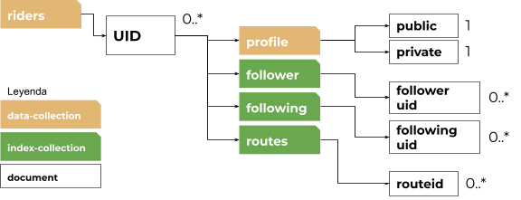
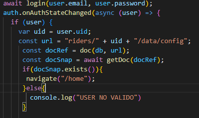

# Riders & Routes Manual Tecnico

**Versión Android App : 2022.0**
**Versión React App: 2022.0**
**Versión Functions: Express API 1.0** 
**Última modificación: 22/05/2022**

**ÍNDICE DE CONTENIDOS SECCIÓN**

**ÍNDICE DE CONTENIDOS GENERALES**

Almacenamiento, seguridad y configuraciones del

servidor

**Almacenamiento de datos FIRESTORE** 

1. Datos de usuarios
1. Datos de rutas y subelementos
1. Datos de mensajería de usuarios

**Almacenamiento de ficheros STORAGE** 

\1. Herarquía de carpetas y ficheros de

usuarios

**Seguridad y configuración del servidor** 

\1. Reglas de seguridad para firestore y storage

Riders & Routes Android Client

**Estructura del modelo** 

1. Servicios Web
1. Local Cache
1. Repositorios

**Estructura de la vista y los controladores** 

\1. Estructura de las vistas, los activities, los fragmentos y los controladores

Riders & Routes Supervisor React Client

**Estructura del modelo** 

1. Servicios Web
1. Acceso a datos

**Estructura de la vista y los controladores** 

1. Iniciar sesión (supervisores)
1. Gestionar tickets
1. Gestionar denuncias

Riders & Routes Functions Express API

**Mapbox Directions API** 

Conexión securizada con Mapbox

**Manipular base de datos cómo administrador**

Manipulación de base de datos con llaves de administrador

**INTRODUCCIÓN**

Este manual está destinado a **desarrolladores** que necesitan conocimientos adicionales sobre el funcionamiento de los servidores, la base de datos y/o los clientes que consumen los mencionados servicios.

Si este documento no resuelve su duda o problema, puede consultar los repositorios públicos de nuestros servicios y abrir una incidencia. También puede contactar con nosotros vía email.

**Almacenamiento, seguridad y configuraciones del servidor**

En esta sección se especifican los lugares de almcenamiento de los distintos datos, la configuración del servidor y cómo manipularla además de otras configuraciones que se pueden tomar por parte del servidor.

**Almacenamiento de datos FIRESTORE**

Para el almacenamiento de datos en forma de texto se emplea la tecnología de **Google Firebase Firestore.** El Firestore es una base de datos **NoSQL** que guarda documentos parecidos a un formato **JSON**.

La base de datos se divide en **colecciones** que contienen dichos **documentos**. Estos mismos documentos pueden tener campos/etiquetas de datos de varios tipos y/o más colecciones que siguen el mismo patrón. Para leer una documentación más detallada sobre el firestore vis[ita esta página.](https://firebase.google.com/docs/firestore)

Los campos/etiquetas son compatibles con los siguientes tipos de datos: string, number, boolean, map, array, null, timestamp, geopoint y reference. Para leer más sobre estos tipos de datos visita [esta página.](https://firebase.google.com/docs/firestore/manage-data/data-types)

1. **Datos de usuarios**

Todos los datos relacionados a un usuario particular serán guardados en un documento bajo la ruta **/riders**. Por cada usuario se generará un documento en dicha ruta. El nombre de este documento será el **UID** único proporcionado por [**FirebaseAuth**, el](https://firebase.google.com/docs/auth) servicio de autenticación.

La estructura de este documento es la siguiente.

***Colección Profile***

Esta colección contiene dos documentos que contienen información acerca del perfil o de la persona a la que pertenece la cuenta.

El documento **private** contiene datos del usuario que no deben ser vistos por otros usuarios como por ejemplo la fecha de nacimiento.

El documento **public** contiene datos del usuario que pueden ser vistos públicamente como su nombre, su apellido, nombre de usuario, descripción de perfil, etc.

***Colección Follower (indexing)***

Esta colección funciona como un fichero de indexado. Aquí se guardan los **UIDs** de los usuarios que siguen esta cuenta. Sólo de esta forma el usuario podrá saber quién le sigue.

***Colección Following (indexing)***

Esta colección funciona como un fichero de indexado. Se almacenan los UIDs de las cuentas que esta cuenta sigue. De esta forma la cuenta puede ver una lista de otros usuarios a los que sigue.

***Colección Routes (indexing)***

Esta colección funciona como un fichero de indexado. Se almacenan los identificadores de las rutas que ha creado el usuario. De esta forma existirá una lista de rutas de cada usuario.

2. **Datos de rutas y subelementos**

Todas las rutas se guardan como documentos con un identificador único en la colección routes bajo la ruta **/routes.**

***Colección images***

En esta colección se guardan documentos de los cuales cada uno de ellos hace referencia a una imágen que ha subido un usuario a esta ruta.

La etiqueta **filename** guardará el nombre de la imagen en el fichero del usuario y la etiqueta **publisher** contendrá el identificador de usuario de aquél rider que haya publicado esa foto. Con estas dos etiquetas se averigua la URL exacta en la que se encontrará la imagen. (Ver documentación sobre Almacenamiento de ficheros STORAGE)

***Colección points\_of\_interest***

En esta colección se guardarán las informaciones de todos los puntos de interés vinculados a esta ruta.

Tendremos el campo **publisher** que especifica el usuario que haya añadido el punto de interés a la ruta; **type** que nos indicará el tipo de punto de interés que es; **name** contiene el nombre del punto de interés; **description** puede ser

personalizada del usuario o ser importada de la API de geolocalización; **gps** tendrá las coordenadas exactas donde situar el punto de interés en el mapa; **featured** es un campo que indica si un punto de interés es publicidad y por lo tanto deberá ser colocado en la parte superior de la página. Esta última etiqueta no es editable por los usuarios, solamente la podrá fijar un supervisor.

***Colección recommended\_bike\_types***

El usuario que publica la ruta puede especificar entre varios tipos de motos la que más recomendable es para dicha ruta. La colección contendrá tantos documentos como tipos de motos que haya seleccionado el usuario. Los nombres de estos documentos revelan el tipo de moto que ha seleccionado el usuario.

***Colección route\_types***

El usuario que publica la ruta puede especificar el tipo de ruta que está publicando. Tendrá para elegir entre varias opciones. La colección contendrá tantos documentos como tipos de ruta que haya seleccionado el usuario. Los nombres de estos documentos revelan el tipo de ruta que ha seleccionado el usuario.

3. **Datos de mensajería de usuarios**

El sistema de mensajería se basa en entidades llamadas **chatgroups** las cuales contienen toda la información de un chat privado o en grupo, sus miembros, administradores, y los propios mensajes.

Una entidad chatgroup tiene la siguiente estructura de datos en nuestra base de datos firestore.

Los chatgroup contienen campos que aún no se usan en la aplicación pero están para futuras actualizaciones que introducirán seguridad y privacidad al chat

Para determinar que un usuario está dentro de un chatgroup existirá adicionalmente un fichero de indexado que guarda todos los Chatgroup ID al que pertenece un rider en su propio perfil bajo */riders/uid/chatgroups*

**Almacenamiento de ficheros STORAGE**

Para el almacenamiento de ficheros como imágenes de los usuarios se emplea **Go[ogle Firebase Storage.** El Stor](https://firebase.google.com/docs/storage?hl=es-419)**age es una base de datos especializada en mantener ficheros de mucho peso como pueden llegar a ser imágenes de alta calidad.

**Herarquía de carpetas y ficheros de usuarios**

En el storage se encuentran bajo la ruta **/riders** las carpetas personalizadas de todos los usuarios de la red social. Cada carpeta tiene como nombre el identificador del usuario al que pertenece.

La carpeta personalizada de un usuario se estructura de la siguiente forma.

La carpeta **images** contendrá todas las imágenes que el usuario suba a cualquier ruta.

La carpeta **profile** contendrá imágenes cuyos nombres son estáticos y que tienen directa relación con el perfil como la imágen de perfil o el banner.

**Seguridad y configuración del servidor**

Para garantizar la integridad de los datos usamos las reglas firebase tanto para el Firestore como el Storage. Estas reglas se establecen para cada colección y/o cada documento por separado. De esta forma se puede con muchísima precición determinar quién tiene permiso para realizar ciertas acciones.

Importante mencionar que NINGÚN endpoint es abierto al público. Se debe tener una cuenta con un email verificado y adicionalmente cumplir las demás restricciones que se establecen para cada fichero/colección.

La mayoría de los documentos y colecciones (exceptuando la colección **private**) son legibles para todo usuario registrado y con email verificado mientras acciones como crear, actualizar o eliminar se restringen según sea necesario.

Por ejemplo, la edición de la foto de perfil o informaciones vinculadas a un perfil sólo podrán ser alteradas por el usuario propietario de dicha cuenta.

*Para alterar las reglas de seguridad debemos entrar en Firestore o Storage y abrir el tab de “Reglas” en la parte superior.*

**Riders & Routes Android Client**

En esta sección se especifica el funcionamiento del cliente nativo de android. Conoceremos el modelo que se utiliza, cómo comunicarnos con los servicios web, el caché local y gestionar el flujo de datos. Además del modelo mostraremos la forma correcta de manipular las vistas principales y navegar por la aplicación.

**Servicios web**

Los servicios web son aquellas clases que establecen comunicación con servidores externos a la aplicación para subir

- recibir datos del usuario.

***Firestore y Storage***

Para recibir los datos de la red social se dispone de un backend anteriormente ya explicado. Para establecer comunicación con la API Rest de este backend debemos usar las clases de utilidad contenidos en nuestra aplicación (**FirestoreHelper** y **FirebaseStorageHelper**) que internamente envían las peticiones de forma estándar con el TOKEN de seguridad proporcionado por el servicio de Authentication.

***Express API (Mapbox API)***

El cliente android para generar rutas necesita ayuda de una API de terceros llamada Mapbox. Para asegurar el correcto uso y acceso a esta API se ha creado una API propia en Express que gestiona todas las cuestiones de seguridad y proporciona la ruta solicitada por el usuario. Para realizar llamadas a dicha Api en Express, debemos usar*ApiUtils.getRouteService().*

Para validar la petición y mantener seguridad la Api Express espera recibir por header AUTHORIZATION un token que verifica la identidad de la propia aplicación (una huella) y por RIDERAUTHORIZATION el token que verifica la identidad del usuario que realiza la petición. Además se habrá que enviar las coordenadas GPS (mín 2) con los que se debe generar la ruta.

**Local caché**

La aplicación dispone de una base de datos local en SQLite que guardará todo tipo de dato relacionado a la red social para quitar carga al backend y de esta forma recuperar datos ya existentes de local.

Se almacenan las cuentas de riders (tanto la propia como la de aquellas visitadas) y con ellas su personalización de perfil, las rutas visitadas con toda su información, los chats y mensajes, …

Cada entidad del modelo tiene un Helper asociado para comunicar con el caché local.

Existe una clase utilidad padre que es la encargada de crear la base de datos al primer arranque, esta clase se llama **SQLiteHelper**.

**Repositorios**

Los repositorios son los encargados de recibir las peticiones de datos de los usuarios y averiguar si esa información ya existe en BBDD local y determinar si se debe devolver esta información o recuperarla preferiblemente de los servicios web. Además a la hora de recuperar datos de los servicios web es el repositorio el encargado de comunicar con la BBDD local y guardar y/o actualizar los registros de los datos proporcionados. De esta forma si la próxima solicitud de datos contiene datos anteriormente solicitados se proporcionarán desde BBDD. Existen repositorios para entidades padres como **Rider**, **Route**, **ChatGroup** y **ChatMessage**. Los repositorios responden a través de listeners que vienen proporcionados por el controlador de la vista que ejecuta el repositorio.

Veamos cómo funcionan las peticiones asíncronas y las interfaces que deben extender los repositorios. Para ello pondremos el ejemplo de cargar la información pública de un rider. Esta es la estructura básica de un repositorio:

- **EntityClass**: es nuestra clase de la entidad que va tratar este repositorio. Ej. Persona o Animal
- **LocalIdClass**: es la clase de identificación en bbdd local que suele ser Integer
- **WebIdClass**: es la clase de identificación en el backend que suele ser String
- **Repository**: es el nombre del propio repositorio que estamos creando

public class Repository

implements RepositoryCRUD<EntityClass, LocalIdClass, WebIdClass, Repository>, RepositoryResponse<Repository> {

private final Context context;

private OnRepositorySuccessListener onRepositorySuccessListener; private OnRepositoryFailureListener onRepositoryFailureListener;

private RiderRepository(Context context) {

this.context = context;

onRepositorySuccessListener = EmptyOnRepositorySuccessListener.newInstance(); onRepositoryFailureListener = EmptyOnRepositoryFailureListener.newInstance();

}

public static RiderRepository newInstance(Context context) {

return new RiderRepository(context);

} }

Antes de comenzar a escribir nuestra primera función que solicitará datos a bbdd o a la web, debemos ver el OnRepositorySuccessListener y el OnRepositoryFailureListener.

public interface OnRepositoryFailureListener {
void onFailure(Exception exception);

}

public interface OnRepositorySuccessListener<R> {

void onSuccess(Optional<Object> result);

}

Nuestros controladores antes de ejecutar una función de petición en el repositorio, añadirán a través de **addOnSuccessListener** y **addOnFailureListener** los códigos que se deben ejecutar tras una petición satisfactoria (que devuelve la información solicitada) o una petición errónea (que devuelve la exception ocurrida).

Más adelante veremos cómo llamar correctamente un repositorio desde un controlador.

Para poder almacenar los datos recibidos por WS el repositorio implementa una función createCache(Entity entity) que realizará una operación parecida a la siguiente:

@Override

public void createCache(Entity entity) {

EntityHelper helper = new EntityHelper(context);

Log.d("REPOSITORY", entity.toString());

try {

if (helper.findByWebId(entity.getWebId()).isPresent())

update(entity);

else

helper.insert(entity);

Log.d("REPOSITORY", "Established local cache of entity");

} catch (DatabaseException e) {

e.printStackTrace();

Log.d("REPOSITORY", "Failed to establish local cache of entity"); }

}

Veamos cómo crear nuestra primera función que ejecuta una solicitud a bbdd y web, actualiza la caché y devuelve la información solicitada. La función que veremos a continuación revisa si un nombre de usuario ya existe a la hora de crear una cuenta nueva y seleccionar un nombre de usuario.

public Repository isNicknameUsed(String nickname) {

EntityHelper helper = new EntityHelper(context);

if (helper.findByNickname(nickname).isPresent()) {

onRepositorySuccessListener.onSuccess(true);

return;

}

FirestoreHelper.of(FirestoreCollection.NICKNAMES)

.getDocumentById(nickname)

.addOnSuccessListener(doc -> {

if (doc != null && doc.exists())

createCache(); onRepositorySuccessListener.onSuccess(Optional.of(true)); else

onRepositorySuccessListener.onSuccess(Optional.of(false)); })

.addOnFailureListener(ex -> {

onRepositoryFailureListener.onFailure(ex)

});

return this;

}

Llamamos al helper de Firestore para solicitar el documento con nombre nickname. Si el documento existe informamos por el onSuccessListener un boolean true de que ya existe el usuario. En caso contrario enviaremos un false por el onSuccessListener. Si la petición web falla (por conexión a internet, seguridad, …) reaccionará nuestro código en addOnFailureListener y llamará al propio onFailureListener para reenviar el error ocurrido.

Si quisiéramos almacenar esta información en bbdd ejecutaríamos un createCache() con la respuesta proporcionada. La próxima vez que el usuario introduzca ese usuario, la función responderá con la información de bbdd.

¿Cómo ejecutamos esta función desde un controlador? Imaginemos que tenemos un boton llamado miButton y que al presionarlo ejecute esta función y recibirá la respuesta. Veamos el siguiente código de ejemplo:

miButton.setOnClickListener(view -> { Repository.newInstance(getApplicationContext())

.addOnSuccessListener(result -> {

boolean b = (boolean) result.get(); System.out.println(b.toString());

})

.addOnFailureListener(ex -> {

System.out.println("Ha ocurrido un error :("); System.out.println(ex.getMessage());

})

.isNicknameUsed("user123");

});

Es importante destacar de nuevo que esto son peticiones asíncronas y que la información puede tardar x tiempo dependiendo de la conexión a internet del usuario y el tráfico dentro del propio servidor.

**Estructura de las vistas, los activities, los fragmentos y los controladores**

Todas las vistas tienen asociado un **xml** que se encuentra en */res/layout* y a cada vista debe haber asociado o un Activity Controller o un Fragment Controller para gestionar los eventos de usuario, etc.

Un botón por ejemplo arranca una nueva ventana abriendo un nuevo activity al que está asociado un nuevo activity controller y una nueva vista.

Todos los activities funcionan así exceptuando la ventana de navegación de la aplicación. El cliente android navega las distintas páginas manteniéndose en el mismo activity y reemplazando los contenedores de fragmentos con el fragmento solicitado. Para ello se usa un patrón visitor. Todos los Fragment Controller que deben poderse ver en la página principal, deben extender la interfaz **MainFragment** para implementar el método *accept*. Este método “accept” llamará su respectiva función en el visitor para ejecutar la carga del fragmento.

Para navegar entonces por la ventana principal se debe usar la clase utilidad y la función:

MainActivityWindowLoader.getInstance().open(new MainFragment());

A continuación puede ver el flujo que se ejecuta al cargar una nueva ventana, menú superior o inferior en el MainActivity:

**Riders & Routes React Client**

En esta sección se especifica el funcionamiento del cliente de React, pensado para uso de administración. Se enseñará cómo se gestionan los datos internos, así como la comunicación con los servicios web y la api. Además del modelo mostraremos la forma correcta de manipular las vistas principales y navegar por la aplicación.

**Servicios web**

Los servicios web son aquellas clases que establecen comunicación con servidores externos a la aplicación para subir

- recibir datos del usuario.

***Api Express***

Debido a que el cliente está pensado para la administración de la app es necesaria la interacción con nuestra API propia express para así poder saltarnos las reglas de seguridad bajo las que están tanto el Firestore como el Storage.

***Firestore***

Para todo lo que es la carga de datos generales de la app se hace uso del SDk normal ya que las seguridad para la lectura de estos dados no es muy estricta

***Firebase Authentication***

El logeo de la aplicación se hace a través del Auth de firebase, lo que agiliza el código y soluciona muchos posibles problemas

**Acceso a los datos**

El acceso a los datos se hace mediante componentes React pensado para cargar los datos en forma de tablas mediante la función:

Estos componentes no solo cargan los datos, también los dejan en forma de tablas que más tarde se cargan en las listas

Para la conección con la api se hace uso de Axios

gracias a ellos se hace uso de la api y se reciben las respuestas de la misma

**Estructura de la vista y controladores**

***Inicio de sesión***

Para el logeo de usuario se hace uso de las funciones de autenticación del Auth de Firebase y es el mismo SDK el encargado de validar al usuario una vez que se pase esta función

una vez pasado este punto se confirma si el usuario es administrador o no

***Gestión de tickets y reportes***

Para la gestión de tickets se hace uso de la Api propia creada para la gestión de estos datos a través de Axios como el ejemplo,

también se hace uso del SDK básico de Firebase a la hora de listar tanto los tickets y los reportes y también para el tratamiento básico de esta información, como son los GET y los PUT

**Riders & Routes Functions Express API**

Esta sección se dirige a explicar el funcionamiento de la API Express desplegada en Firebase Functions. Principalmente se usa para establecer comunicación con Mapbox y guardar las respuestas de rutas que nos proporciona la API de Mapbox. Además la API express tiene llaves de administrador que permiten manipular como supervisor los datos de bbdd ignorando reglas de seguridad que existen para los usuarios normales. Sólamente de esta forma es posible que un supervisor pueda eliminar contenido (por ejemplo por denuncias) de la red social.

**Mapbox Directions API**

Para minimizar la cantidad de peticiones que se lanzan hacia la API de Mapbox que se encarga de calcular un objeto GeoJSON (representación de una ruta) según unos puntos de referencia se guarda la respuesta que está nos proporciona en la base de datos. Esto permite que los usuarios que visiten una ruta de un usuario cargue únicamente la respuesta ya existente en bbdd y no tengan que re-enviar una petición de cálculo a Mapbox.

Para guardar dicha respuesta se requería de un software intermedio que ataque directamente el endpoint adecuado que devuelve la respuesta deseada. Veamos cómo funciona:

La API express cuenta con la URL **/routes/newMapiResponse** que es la encargada de recibir la petición del usuario, validar seguridad, validar la existencia de puntos de referencia, enviar la petición a mapbox y devolverla al usuario. Veamos cómo se debe enviar la petición a nuestra API express:

*GET /api/routes/newMapiResponse*

**HEADERS REQUERIDOS**

- **AUTHORIZATION** = "Bearer **TOKEN**" El token debe ser la huella identificativa de la aplicación cliente (Android) o la llave de desarrollador.
- **RIDERAUTHORIZATION** = "Bearer **TOKEN**" El token debe ser la huella identificativa del usuario que realiza la petición.

**PARÁMETROS REQUERIDOS**

- **waypoints** = Lista de puntos GPS (LAT,LON) separados por

; (ASCII) , (%2C) ; (%3B) Example: -18.000000000,16.000000000;-19.000000000,15.00000000 0 =>

-18.000000000%2C16.000000000%3B-19.000000000%2C15 .000000000

Una URL válida incluyendo los HEADERS en la petición sería la siguiente:

/api/routes/newMapiResponse?waypoints=-18.000000000%2C16. 000000000%3B-19.000000000%2C15.000000000

A continuación vemos el funcionamiento interno de la API para realizar estas operaciones:

router.get('/newMapiResponse', isAuthenticated, function (req, res) {

// Validators

let waypoints = getUrlParams(req.url).waypoints;

if (waypoints === undefined) {

res.status(StatusCodes.BAD\_REQUEST).send("No waypoints found"); return;

}

// Command

const run = async (waypoints, res) => {

try {

let url = getRouteRequestUrlByAsciiSeparation(waypoints); let { data } = await axios.get(url); res.status(StatusCodes.OK).send(data);

} catch (err) {

res.status(StatusCodes.INTERNAL\_SERVER\_ERROR).send(err); }

};

run(waypoints, res);

});

Vemos que el endpoint solo acepta métodos GET y además pasa por el middleware **isAuthenticated** para comprobar la integridad del Token del usuario que realiza la petición.

*isAuthenticated middleware:*

const getAuthToken = (req, res, next) => {

if (

req.headers.riderauthorization && req.headers.riderauthorization.split(' ')[0] === 'Bearer'

) {

req.authToken = req.headers.riderauthorization.split(' ')[1]; } else {

req.authToken = null;

}

next();

};

const isAuthenticated = (req, res, next) => {

getAuthToken(req, res, async () => {

try {

const { authToken } = req;

const userInfo = await admin

.auth()

.verifyIdToken(authToken); req.authId = userInfo.uid;

return next();

} catch (e) {

return res

.status(StatusCodes.UNAUTHORIZED)

.send(ReasonPhrases.UNAUTHORIZED + " Send your rider TOKEN via HEADER riderauthorization as OAUTH 2.0");

}

});

};

Tras la validación de seguridad se crea la URL de petición a Mapbox con la función getRouteRequestUrlByAsciiSeparation.

const getRouteRequestUrlByAsciiSeparation = (waypoints) => {

const url = directionsUrl + waypoints + attributes; return url;

};

Finalmente se ejecuta un GET con Axios a dicha URL y se devuelve el resultado al usuario.

**Manipular base de datos como administrador**

Para facilitar el tratamiento de los datos en la aplicación React, que está pensado para la administración de la app, se hace uso del SDK Admin de Firebase, este hace uso de casi las mismas funciones que el SDK de uso normal pero con la diferencia de que se salta todas las reglas que se le tengan puesto a las diferentes BBDD de Firebase. La configuración e inicialización es un poco diferente, ya que necesita de un Json especial con una claves únicas que se generan solo para esa implementación, la manipulación de este archivo se tiene que hacer con sumo cuidado y nunca se debe poner al alcance de ningún usuario.

Donde cobra más importancia este sdk en la parte de Authentication, es donde se encuentran las funciones únicas de este, con las funciones de administración de usuario, un ejemplo es la desactivación de cuentas

